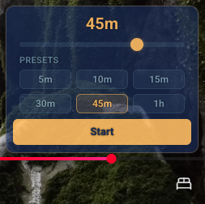
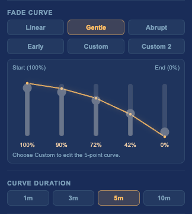
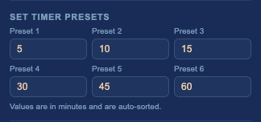

# BetterSleepTimer

**A Chrome extension that adds a fade-out sleep timer to YouTube.**

YouTube's native sleep timer cuts the sound off completely. BetterSleepTimer fades it out gradually instead, with a wide range of customization options for fade curves, durations, and timer presets. As far as I know, no other Chrome extension does this — so I built one.

<table>
<tr>
<td align="center"><b>In-Player Overlay</b></td>
<td align="center"><b>Fade Curve Editor</b></td>
<td align="center"><b>Timer Presets</b></td>
</tr>
<tr>
<td align="center"></td>
<td align="center"></td>
<td align="center"></td>
</tr>
</table>

## Features

- **Fade curve control** — Linear, Gentle, Abrupt, Early, and two fully editable custom curves
- **Adjustable fade duration** — 1, 3, 5, or 10 minutes
- **Quick-access timer presets** — six configurable presets, auto-sorted for fast selection
- **In-player overlay** — start, adjust, and cancel the timer without leaving fullscreen
- **Persistent state** — timer survives page navigation and reloads

## Installation

1. Download the latest release from [Releases](https://github.com/your-repo/releases)
2. Unzip and go to `chrome://extensions`
3. Enable **Developer mode** and click **Load unpacked**
4. Select the extracted folder

## Roadmap

- [ ] End behavior options (pause, mute, or both)
- [ ] Keyboard shortcuts
- [ ] Banner position and visibility controls
- [ ] Live volume percentage display
- [ ] Fade interval speed control

## License

MIT
